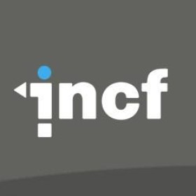
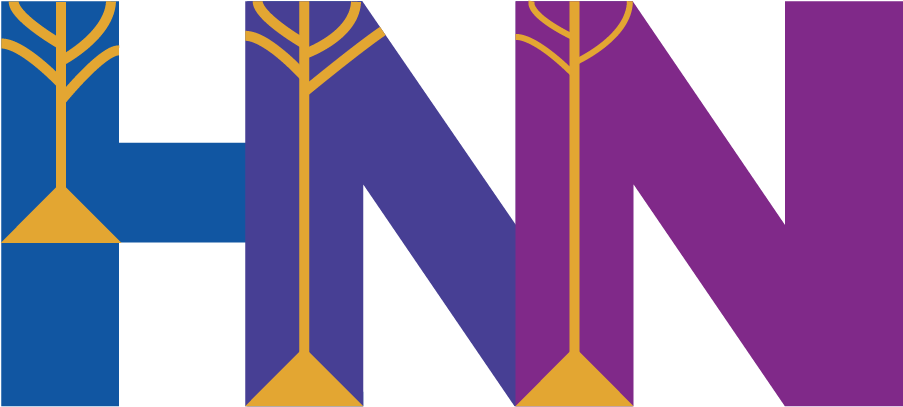

<div align="center">

# Satvik Saluja

**ML · Scientific Computing · Reproducible Simulation Systems**

*Building continuous-time dynamical models, simulation validation infrastructure, and graph-based biological systems*

</div>

---

## 🏆 Google Summer of Code 2026

<div align="center">

<table border="0" cellspacing="0" cellpadding="24">
  <tr>
    <td align="center" width="180">
      <br/>
      <sub><b>Google Summer of Code 2026</b></sub><br/>
      <sub>✅ Accepted</sub>
    </td>
    <td align="center" width="60"><sub>×</sub></td>
    <td align="center" width="180">
      <br/>
      <sub><b>INCF</b></sub><br/>
      <sub>Mentoring Organization</sub>
    </td>
    <td align="center" width="60"><sub>×</sub></td>
    <td align="center" width="180">
      <br/>
      <sub><b>HNN-Core</b></sub><br/>
      <sub>Project Repository</sub>
    </td>
  </tr>
</table>

</div>

**Project:** Refactoring Synaptic Behavior in HNN-Core

Selected as a **GSoC 2026 contributor** under **INCF** to improve biological realism in HNN-Core — placing synapses only at active connection sites, making synapse position along sections configurable, recording currents only from active synapses, and adding seeded biological variability to synaptic weights and delays.

> **Primary Mentor:** Katharina Duecker &nbsp;·&nbsp; **Mentors:** Nicholas Tolley, Austin Soplata, Anna Cattani

---

## About

Working at the intersection of ML and computational neuroscience — where correctness is verifiable and reproducibility is enforced by architecture.

GSoC 2026 contributor to **HNN-Core** (INCF), shipping production-quality changes to NEURON-based synaptic simulation internals.

Focus: Neural ODEs · Modular simulation pipelines · Structured validation frameworks for scientific Python

---

## Languages & Tools

<p align="center">
 <a href="https://www.python.org/"></a>&nbsp;
 <a href="https://www.typescriptlang.org/"></a>&nbsp;
 <a href="https://developer.mozilla.org/en-US/docs/Web/JavaScript"></a>&nbsp;
 <a href="https://docs.microsoft.com/en-us/cpp/?view=msvc-170"></a>&nbsp;
 <a href="https://reactjs.org/"></a>&nbsp;
 <a href="https://fastapi.tiangolo.com/"></a>&nbsp;
 <a href="https://pytorch.org/"></a>&nbsp;
 <a href="https://www.tensorflow.org/"></a>&nbsp;
 <a href="https://www.linux.org"></a>
</p>

<p align="center">
  
  
  
  
  
  
  
  
  
  
  
</p>

---

## Core Areas

```
Neural ODEs · Dynamical Systems · Simulation Pipeline Design
Numerical Validation · Solver Benchmarking · Graph Neural Networks
Biological System Modeling · ONNX Deployment · Scientific Python
NEURON Simulation · Synaptic Modeling · Computational Neuroscience
```

---

## Selected Projects

| Project | Stack | What it does |
|---|---|---|
| [HNN Simulation Validation](https://github.com/SatvikSaluja/hnn_simulation) | Python · NumPy · SciPy · pytest | Modular validation pipeline for neural simulation outputs — peak latency checks, waveform integrity, composable validator modules per drive type |
| [Neural ODE Cognitive Simulator](https://github.com/SatvikSaluja/Neuro-ODE) | PyTorch · torchdiffeq · FastAPI | Continuous-time model `dS/dt = f(S,U,θ)` of EEG-derived cognitive states using adaptive solvers (dopri5, RK45) |
| [Metabolic Pathway GNN](https://github.com/SatvikSaluja/TCA-PPP-glycolysis-simulation) | PyG · GATv2 · FastAPI · React | Glycolysis / TCA / PPP as bipartite graphs; GATv2 + FiLM for flux prediction, validated against literature ranges |
| [AirAware — Browser AQI](https://github.com/SatvikSaluja/AirAware) | ONNX Runtime · React · Tailwind | AQI model exported to ONNX, deployed client-side; <0.1% deviation vs Python outputs confirmed |

---

## Links

<p align="center">
  <a href="https://kaleidoscopic-souffle-ce8b9e.netlify.app/"></a>
</p>
